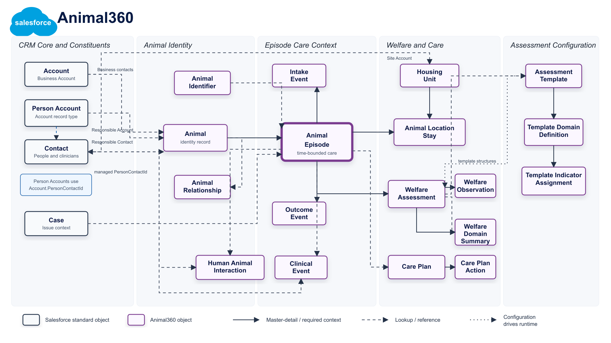
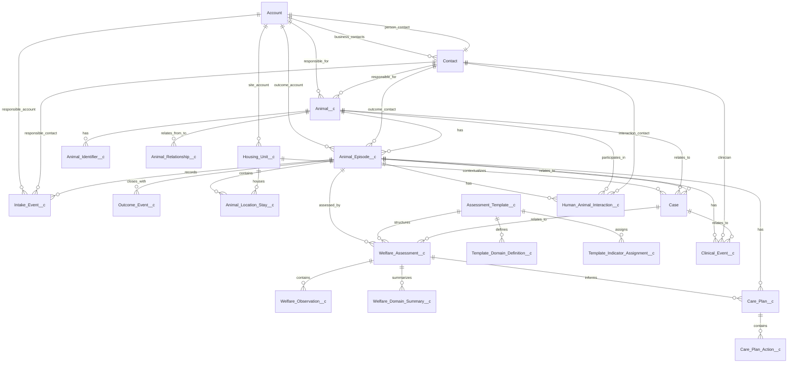

# Animal360 Data Model

This page documents the Animal360 application architecture in the style of the Salesforce Data Model Gallery. It summarizes the core entities, relationships, and implementation status for the connected `animal360` Salesforce org.

Entities and relationships for managing animal identity, time-bounded care episodes, housing, welfare evidence, assessments, interventions, constituents, and current-state reporting.

Animal, Animal Episode, Animal Location Stay, Housing Unit, Intake Event, Outcome Event, Assessment Template, Template Domain Definition, Template Indicator Assignment, Welfare Assessment, Welfare Observation, Welfare Domain Summary, Care Plan, Care Plan Action, Clinical Event, Human Animal Interaction, Account, Person Account, Contact, Case

See [Salesforce Data Model Notation](https://developer.salesforce.com/docs/platform/data-models/guide/salesforce-data-model-notation.html).

## Scope

Animal360 is implemented as a single-package Salesforce DX application rooted at `force-app`. The current model covers Phase I operational care tracking and Phase II welfare evidence capture.

Phase I establishes the foundational operational model:

- animal identity
- time-bounded care episodes
- housing and location stays
- intake, movement, and outcome events
- current-state rollups

Phase II adds the welfare intelligence layer:

- metadata-driven assessment templates
- structured observations aligned to the Five Domains model
- domain summaries and inferred mental-state summary
- risk evaluation
- care plans and care-plan actions
- clinical and human-animal interaction records

## Implementation Status

The connected `animal360` org was inspected with Salesforce CLI against API version 66.0.

| Area                      | Status  | Evidence                                                                                                                                                                                       |
| ------------------------- | ------- | ---------------------------------------------------------------------------------------------------------------------------------------------------------------------------------------------- |
| Core runtime objects      | Present | 16 expected Phase I and Phase II core objects exist in the org.                                                                                                                                |
| Phase I operations        | Present | `Animal__c`, `Animal_Episode__c`, `Animal_Location_Stay__c`, `Housing_Unit__c`, `Intake_Event__c`, and `Outcome_Event__c` are deployed.                                                        |
| Phase II welfare evidence | Present | `Welfare_Assessment__c`, `Welfare_Observation__c`, `Welfare_Domain_Summary__c`, `Assessment_Template__c`, `Care_Plan__c`, `Clinical_Event__c`, and `Human_Animal_Interaction__c` are deployed. |
| Active automation         | Present | 11 `A360_*` flows have active versions in the org.                                                                                                                                             |
| Apex service layer        | Present | 13 `A360*` Apex classes are deployed, including Phase I integrity services and Phase II assessment, risk, care-plan, template, and reminder services.                                          |
| Security model            | Present | 5 role permission sets are deployed: admin, care manager, assessor, clinical user, and read-only.                                                                                              |
| Runtime template seed     | Present | The org has 1 runtime assessment template, 5 domain definitions, and 6 indicator assignments.                                                                                                  |
| Packaged configuration    | Present | Custom metadata includes 5 domain definitions, 6 indicator definitions, and 6 risk rules.                                                                                                      |

## Architecture Principles

Animal360 follows the principles from the Phase I and Phase II foundation documents.

| Principle                                | Implementation                                                                                                                                                                                               |
| ---------------------------------------- | ------------------------------------------------------------------------------------------------------------------------------------------------------------------------------------------------------------ |
| Model reality first                      | The data model separates identity, care context, location, events, evidence, interpretation, and action.                                                                                                     |
| Episode-based architecture               | `Animal_Episode__c` is the parent context for operational events, location stays, welfare assessments, care plans, clinical events, and interactions.                                                        |
| Objective evidence before interpretation | `Welfare_Observation__c` stores observed values; `Welfare_Domain_Summary__c` stores interpretation by domain; `Welfare_Assessment__c` stores the overall assessment and Domain 5 mental-state summary.       |
| Location as a first-class entity         | `Housing_Unit__c` and `Animal_Location_Stay__c` model environment and time-based placement separately from animal identity.                                                                                  |
| Events as records                        | Intake and outcome are modeled as event records, and movement is represented through location stay start and end times.                                                                                      |
| Metadata-driven design                   | Custom metadata stores packaged domain, indicator, option, template, risk, automation, species, and status transition configuration. Runtime template records provide active org-level assessment structure. |
| Salesforce standard object reuse         | `Account`, Person Accounts, `Contact`, and `Case` are extended instead of duplicated for organizations, individuals, people, and welfare or operational issues.                                              |

## CRM and Person Accounts

The connected org has Person Accounts enabled. This is represented in Salesforce as an `Account` record type, not as a separate object. The org includes active `Account` record types for `Business_Account` and `PersonAccount`; the `Account` object also exposes `IsPersonAccount`, `PersonContactId`, `PersonEmail`, and `PersonMobilePhone`.

Animal360 uses this CRM layer as follows:

- `Account` represents organizations, sites, partners, owner/adopter households, and Person Account individuals.
- Person Accounts are Account records with a Salesforce-managed linked Contact through `Account.PersonContactId`.
- `Contact` remains part of the model for business contacts, clinicians, interaction participants, and responsible contacts.
- `Animal__c.Responsible_Account__c` and `Animal__c.Responsible_Contact__c` keep animal responsibility explicit.
- `Intake_Event__c`, `Animal_Episode__c`, `Clinical_Event__c`, and `Human_Animal_Interaction__c` use Account and Contact lookups where the operational event needs responsible, outcome, clinician, or interaction context.

## Entity Relationship Overview

## Core Entities

### Animal

Represents the animal identity record. Animal identity is intentionally separate from care context, location, assessments, and events.

Key CRM fields include:

- `Responsible_Account__c`
- `Responsible_Contact__c`

Key related entities:

- Animal Episode
- Animal Identifier
- Animal Relationship
- Human Animal Interaction

### Animal Episode

Represents a time-bounded context of care. This object is the backbone of the model and is the primary parent for operational and welfare activity.

Key fields include:

- `Animal__c`
- `Episode_Type__c`
- `Episode_Status__c`
- `Intake_DateTime__c`
- `End_DateTime__c`
- `Current_Location_Stay__c`
- `Current_Welfare_Level__c`
- `Current_Clinical_Priority__c`
- `Next_Review_Date__c`

Key related entities:

- Intake Event
- Outcome Event
- Animal Location Stay
- Welfare Assessment
- Care Plan
- Clinical Event
- Human Animal Interaction

### Housing Unit

Represents a physical or operational housing location. Housing is modeled independently so capacity and environment can be managed without flattening location state onto the animal record.

Key related entities:

- Animal Location Stay
- Account

### Animal Location Stay

Represents a time-bounded placement of an animal episode in a housing unit.

Key fields include:

- `Animal_Episode__c`
- `Housing_Unit__c`
- `Start_DateTime__c`
- `End_DateTime__c`
- `Is_Current__c`
- `Move_Reason__c`

### Welfare Assessment

Represents a structured welfare assessment for an animal in a specific episode.

Key fields include:

- `Animal_Episode__c`
- `Animal__c`
- `Assessment_Template__c`
- `Assessment_DateTime__c`
- `Assessment_Type__c`
- `Assessment_Status__c`
- `Overall_Welfare_Concern__c`
- `Domain_5_Mental_State_Summary__c`
- `Immediate_Action_Required__c`

### Welfare Observation

Represents objective evidence captured during an assessment. Observations support multiple value types so indicator definitions can remain metadata-driven.

Key fields include:

- `Welfare_Assessment__c`
- `Indicator_Key__c`
- `Domain_Code__c`
- `Observed_Boolean__c`
- `Observed_Picklist_Value__c`
- `Observed_Numeric_Value__c`
- `Observed_Text__c`
- `Severity_Level__c`
- `Enhancement_Level__c`
- `Evidence_Source__c`
- `Requires_Intervention__c`

### Welfare Domain Summary

Represents the interpreted summary for one Five Domains domain in an assessment.

Key fields include:

- `Welfare_Assessment__c`
- `Domain_Code__c`
- `Negative_Grade__c`
- `Positive_Grade__c`
- `Key_Findings__c`
- `Inferred_Affects__c`
- `Action_Required__c`

### Assessment Template

Represents the runtime assessment structure used by active assessment entry.

Key related entities:

- Template Domain Definition
- Template Indicator Assignment
- Welfare Assessment

### Care Plan

Represents an intervention plan linked to an episode and optionally sourced from a welfare assessment.

Key fields include:

- `Animal_Episode__c`
- `Primary_Assessment__c`
- `Plan_Type__c`
- `Status__c`
- `Primary_Goal__c`
- `Success_Criteria__c`

### Care Plan Action

Represents a task or intervention within a care plan.

Key related entity:

- Care Plan

### Clinical Event

Represents a clinical observation, treatment, or follow-up event linked to an animal episode and animal.

### Human Animal Interaction

Represents Domain 4 interaction evidence, including interaction type, human role, interaction quality, animal response, and follow-up indicators.

## Automation Model

Animal360 uses flows for orchestration and Apex services for integrity, persistence, and metadata-driven logic.

Primary operational flows:

- `A360_Intake_Flow`
- `A360_Move_Animal_Flow`
- `A360_Close_Episode_Flow`
- `A360_Animal_Current_State_Rollup_Flow`
- `A360_Episode_Current_State_Trigger_Flow`
- `A360_Location_Stay_Current_State_Trigger_Flow`

Primary welfare flows:

- `A360_Welfare_Assessment_Flow`
- `A360_Assessment_Risk_Evaluation_Flow`
- `A360_Create_Care_Plan_Flow`
- `A360_Care_Plan_Auto_Create_Flow`
- `A360_Review_Due_Reminder_Flow`

Primary Apex service areas:

- animal and episode integrity
- current-state rollups
- assessment template seeding and guardrails
- assessment payload persistence
- risk evaluation
- care plan creation
- review reminder generation

## Reporting Model

The reporting model follows the same entity boundaries as the operational model.

Included custom report types cover:

- animals with episodes
- episodes with location stays
- housing units with location stays
- episodes with welfare assessments
- welfare assessments with observations
- episodes with care plans
- episodes with clinical events
- episodes with human-animal interactions

## Security Model

Animal360 uses permission sets rather than profile-centric access.

Packaged permission sets:

- `Animal360_Admin`
- `Animal360_Care_Manager`
- `Animal360_Assessor`
- `Animal360_Clinical_User`
- `Animal360_Read_Only`

Custom permissions:

- `A360_Manage_Assessment_Templates`
- `A360_Welfare_Escalation_Override`

## Notes

The included PNG is rendered from `docs/animal360-data-model-salesforce-style.svg` so the published image and source diagram can be reviewed together.
